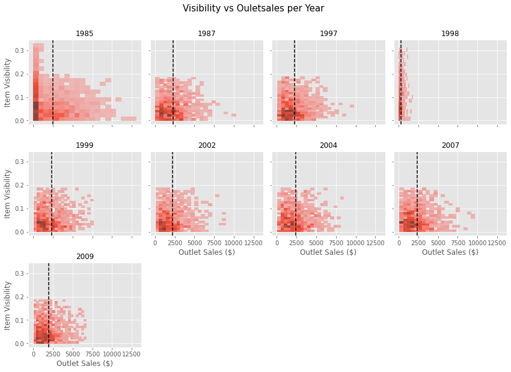
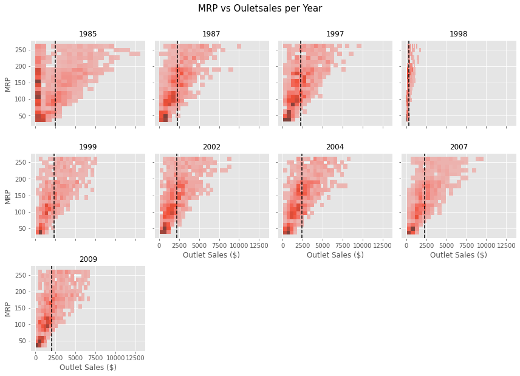
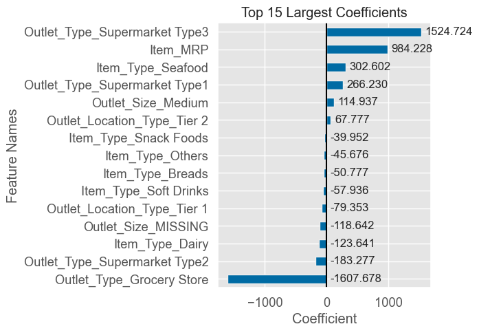
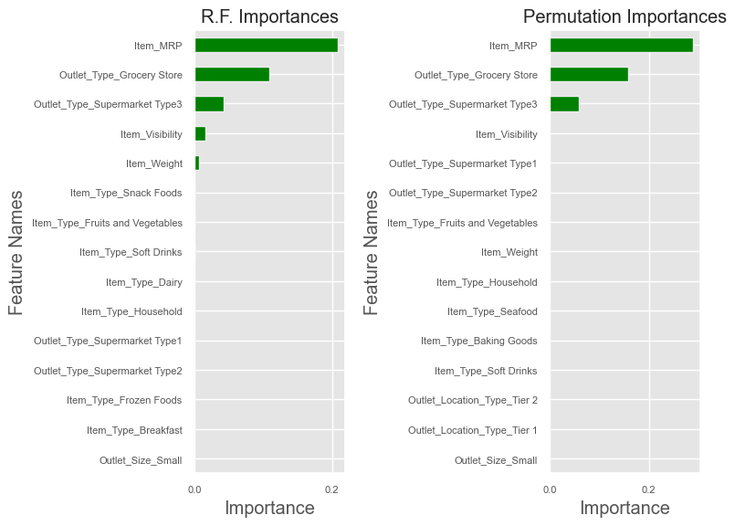

# Sales Predictions

By: Israel Diaz

The goal of the project is try to predict the sales for food items at various stores, with the purpose to help retailers to undestand the properties of products and sales that play crucial roles in increasing sales. 

---

## Description of the Data

The data frame register 8523 entries and 12 variable. Each variable represent the following.

### Dictionary

|Variable Name            	| Description                                                                                       |
|---------------------------|---------------------------------------------------------------------------------------------------|
|Item_Identifier            |	Unique product ID                                                                               |
|Item_Weight	            | Weight of product                                                                                 |
|Item_Fat_Content           |	Whether the product is low fat or regular                                                       |
|Item_Visibility          	|The percentage of total display area of all products in a store allocated to the particular product|
|Item_Type	                |The category to which the product belongs                                                          |
|Item_MRP	                |Maximum Retail Price (list price) of the product                                                   |
|Outlet_Identifier          |Unique store ID                                                                                    |
|Outlet_Establishment_Year	|The year in which store was established                                                            |
|Outlet_Size	            |The size of the store in terms of ground area covered                                              |
|Outlet_Location_Type	    |The type of area in which the store is located                                                     |
|Outlet_Type	            |Whether the outlet is a grocery store or some sort of supermarket                                  |
|Item_Outlet_Sales         	|Sales of the product in the particular store. This is the target variable to be predicted.         |

### Source of the Data

[Big Mart Sales Prediction](https://datahack.analyticsvidhya.com/contest/practice-problem-big-mart-sales-iii/)

To prepare the data for exploratory analysis, I performed data cleansing by basically removing duplicate values, correcting inconsistencies in data types, and imputing missing values.

---

## Exploratory Analysis

I have found two major insights from the analysis:

* Despite how little intuitive, the wider range of sales occured in items with low visibility.
* I found a moderate positive correlation between the MRP value and the Sales, so the more MRP, the wider range of sales. 

**Item_Visualization vs Outlet Sales**

**Item MRP vs Outlet Sales**

---

## Model Evaluation

To make the Sales predictions I have built 2 models, Linear Regression and Decision Tree, the models were made as follows:

* Both linear regression and random forest regressor obtained similar results on RMSE and R^2 Score values.
* It would be necessary to try another model, such as XGBoost for example, to see if the result improves.
* So far, the model that works best is the Random Forest Regressor.

### Results

**Linear Regression Scores**

|     | Train       | Test        |
|-----|-------------|-------------|
|RMSE | 1139.58     | 1094.27     |
|R^2  | 0.56        | 0.57        |

The coefficient analysis comes out with the following results:

Considering that our numerical variable have been scaled:

* Our model assumed a baseline score of 7264.81
* Coefficient that positively influence the model:
    * Outlet_Type_Supermarket Type 3: Selling the items on these types of supermarket results in more sales by 1624.80
    * Item_MRP: Maximum Retal Price also affect positively the sales in 984.32
    * Item_Type_Seafood: Having seafood increases their sales by 199.41
* Coefficients that negatively influence the model:
    * Outlet_Type_Grocery Store: that is that selling in grocery stores have a negative impact of -1741.07.
    * Item_type_Dairy: this variable has a negative impact of -124.04 in the sales.
    * Outlet_Type_Supermarket Type2: this variable impact negatively by -83.15 in the sales.

**Random Forest Regressor**

In our previous Analysis, we fit a decision tree model, at this time we decided to do it with a Random Forest Regressor, in which we had tuned the hyperparameters using the RandomSearchCV library. 

|     | Train       | Test        |
|-----|-------------|-------------|
|RMSE | 944.05      | 1061.56     |
|R^2  | 0.70        | 0.59        | 

For out random forest model we can extract the following analysis from the features:

Comparing the random forest feature importances and the permutation importances above, we can see that:

* The most important feature in both is Item_MRP.
* The 4 most important features are the same in both, in the exact same order:
    * Item_MRP
    * Outlet_Type_Grocery Store
    * Outlet_Type_Supermarket Type3
    * Item_Visibility
* The 5th most important feature is Item_Weight in RF Feature Importance, and Outlet_Type_Supermarket Type1 in Permutation Importance.

**Feature Importance using SHAP**

We can see that the most important features are the same (5 most important ones). The only difference is that the feature importance from the past analysis was based on the mean decrease in impurity. The SHAP summary plot is based on the magnitude of the effect on the model output. The SHAP summary plot is more accurate because it takes into account the interaction between the features.

According to the graph above we can do some interpretation about how each feature pushes the prediction to one or another direction. 

The 3 more important features are the following:

| Feature                            | Interpretation                                                                                                                        |
|------------------------------------|---------------------------------------------------------------------------------------------------------------------------------------|
| **Item_MRP:**                      | As the red dots are on the right side of the plot, we can see that the higher the MRP of the item, the higher the sales.              |
| **Outlet_Type_Grocery Store:**     | As the red dots are on the left side of the plot, we can see that the model is likely to predict lower sales for grocery stores.      |
| **Outlet_Type_Supermarket Type3:** | As the red dots are on the right side of the plot, we can see that the model is likely to predict higher sales for Supermarket Type3. |

**Local Explanations**

We selected 2 observations for trying to interprete the model does the predictions, first the lower sales from grocery stores (as the grocery is the lower sales class) and higher sales from Supermarket Type3 (as the SMT3 is the higher sales class)

* Low Sales from Grocery Store

    * SHAP Force plot 
    

    * LIME plot
    

Both graphs shows the same result, grocery store class is pulling the model down.

* Higher Sales from Supermarket Type3

    * SHAP Force plot 
    

    * LIME plot
    

This wasn't expected, both graphs gives diferent outcomes. For the force plot the Item_MRP is pushing the model up, so the higher the prices the higher the sales. For the Lime Tabular explainer the most influential class is Grocery Store (which is labeled as 0) and the second one is Item_MRP; in few words, as long as it is not a grocery store the sales will be high. 

---

## Conclusions

* Both linear regression and decision trees obtained similar results with regard to RMSE and R^2 Score values on the test set.
* Depending on the model to use, would be necessary to evaluate how the features take effect on the final outcome:
    * In Logistic Regression, it would be necessary to pay careful attention to Outlet_Type_Supermarket Type3, Item_MRP, Item_Type_Seafood, Outlet_Type_Supermarket Type1 on one side, and Outlet_Type_Grocery Store, Outlet_Type_Supermarket Type2, Item_Type_Dairy on the other, because they highly push the sales on one or other direction.
    * In Randon Forrest, Item_MRP definitely have a huge importance for the model, and then Outlet_Type_Grocery Store, Outlet_Type_Supermarket Type3, Item_Visibility, as well.

---

## Recommendation

Based on the results I recommend to use the Decision Tree models to performe predictions. 

---

## For Further Information

For any additional questions, please contact:

    Israel Diaz (Data Scientist in Training)
    diaz.israel@aol.com

